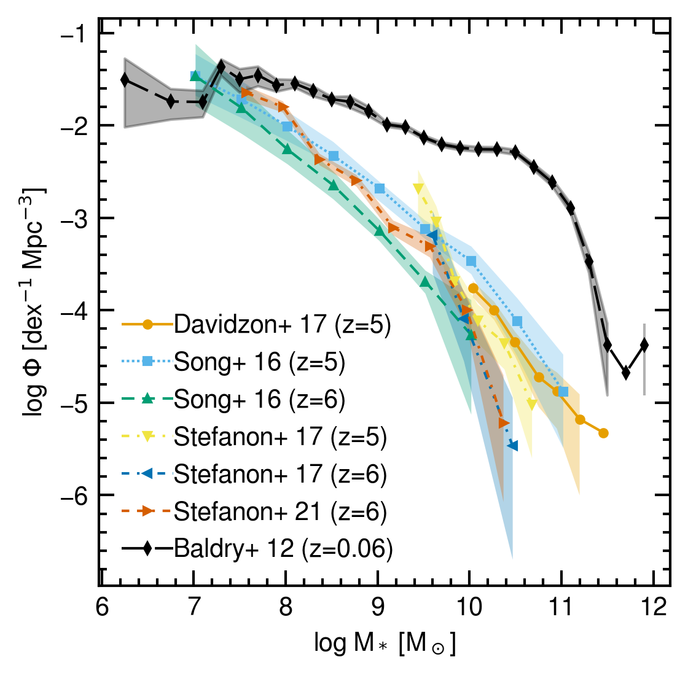

# observational-data

Usage
=====
Clone this repository and set environment variables as follows
```
git clone https://github.com/YuriOku/observational-data.git
export OBSDATA_DIR=/Users/yuri/Documents/GitHub/observational-data ## SET YOUR PATH
export PYTHONPATH=$OBSDATA_DIR:$PYTHONPATH
```

Example
=======
``` python
import matplotlib.pyplot as plt
import load_obsdata as obs

d = obs.load_obsdata("SMF", 5, 6)

plt.figure(facecolor="white")
for di in d:
  plt.plot(di["x"], di["y"], label=di["label"], ms=3)
  plt.fill_between(di["x"], di["y1"], di["y2"], alpha=0.3)

d = obs.load_target_obsdata("SMF", "baldry2012_z0")
plt.plot(d["x"], d["y"], label=d["label"], ms=3, color="black")
plt.fill_between(d["x"], d["y1"], d["y2"], alpha=0.3, color="black")

plt.xlabel(r"log M$_*$ [M$_\odot$]")
plt.ylabel(r"log $\Phi$ [dex$^{-1}$ Mpc$^{-3}$]")
plt.legend()
plt.savefig("example.png", bbox_inches="tight")
plt.close()
```


The figure above is plotted with [this matplotlibrc](https://gist.github.com/YuriOku/964adda6649e0bbc76de1a8f9010fe1a)